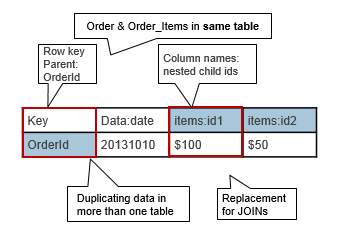

# System Architecture Examples

## Spelling Suggestion Service

- Read a big file with lots of words.
- Normalize the file: remove anything that's not a-z and make it lower-case.
- Generate a count parameter for the frequency of each word in the English language, giving it a sort of score.
- When the spelling suggestion word comes in, process it to find the following variants of the word (suitable corrections):
    - Transposing letters
    - Adding letters
    - Removing letters
    - Replace existing letter
- Total variations for a word of length n is: ~54n+25 (for English alphabet with 26 letters).
- Decide if 1 edit is enough, or if you want to try 2/3/4 edits, etc. (1/2 is prob. enough).
- To add another edit just run the function that generates edits on the results of the first run.
- Now keep only variations that are known as words, from the words list we generated at the beginning.
- Factor in plural form, present/past tenses, etc.
- Sort by score, descending.

## Search Engine

- Separate the system to different parts:
    - Web crawler – retrieve new documents, update content of existing ones
    - Document store – contain document content and all metadata (URL, date, etc.)
    - Indexer – create the index
    - Querying – serving search requests
    - Ranking – sorting the results

### Indexing

- Define the corpus (document collection). How will we get it? Designing a web crawler is a whole topic on its own (but might still be in the scope of such a question).
- Likely want to ignore casing, grammatical tenses, "stop words" (most common words in a language, e.g., the, is, at, which, on, etc.).
- Build an *Inverted Index* from parsing the documents. Given a query the index can return the list of documents relevant for it.
- Each vocabulary term is a key in the index whose value is its documents list.
- Inverted index will also contain additional information such as: overall number of occurrences (frequency), occurrence position in each document.
- Parse each document:
    - Lower case all input.
    - Extract tokens; Token = alphanumeric `[a-z0-9]` characters terminated by a non-alphanumeric character.
    - Filter out stop words.
    - Use stemming (Porter Stemmer for English, for example) to remove common endings from words (-s, -ing, -er, -ed, etc.).
- Inverted index will be a (distributed) hash table in memory: `Map<String, List<DocumentOccurrences>>` (see below).
- Index can be persisted to disk in a simple format, or saved to datastore.
- Rough rule of thumb: for a document collection of size X, the index size will be 0.66X.
- Distribution of terms in a collection generally follows Zipf's Law, which states that the frequency of a word is inversely proportional to its rank; i.e., most frequent word will appear 2x more than second most popular and 5x most then fifth most popular word.

```java
class DocumentOccurrences {
    public String documentId;
    public int[] positions;
}
```

### Querying

- Query types:
    - Single word queries
    - Free text queries – documents containing all keywords, regardless of order
    - Phrase queries – documents containing all keywords in exact query order
- Read the inverted index from disk or datastore into the same data structure.
- Document word transformations (grammar, stop words, stemming) will also be done on incoming querie as well (but maybe not for exact phrase queries).
- For single word queries: get the list of `documentId`s that contain that word from the index and return that list.
- For free text queries:
    - Tokenize the query.
    - Get the list of documents for each token.
    - Take the *union* of all results.
- For exact phrase queries:
    - Just like free text queries but take the *intersection* of all `documentId`s from all results (can use Java's `List.retainAll` or `Set.retainAll`).
    - Next, for each document, get positions for each search term, and place the positions in separate lists as the order or the search terms.
    - Subtract `i-1` from the elements (positions) of the `i`-th list, starting from the second list (not changing the first one).
    - Take the intersection of the lists (or better: sets). If it's not empty then that document is a match for the exact phrase. Perform the same for the rest of the documents.

### Ranking

Ranking algorithms options:
- [tf-idf](https://en.wikipedia.org/wiki/Tf%E2%80%93idf) (term frequency–inverse document frequency) – Reflect how important a word is to a document in a collection. Used as a weighing factor by assigning each term in a document a weight based on its term frequency (tf) and inverse document frequency (idf). Terms with higher weight scores are considered more important. tf-idf value increases proportionally to the number of times a word appears in the document, but is offset by the frequency of the word in the corpus, which helps to adjust for the fact that some words appear more frequently in general.
- [Okapi BM25](http://en.wikipedia.org/wiki/Okapi_BM25) – state-of-the-art variant of tf-idf.
- [PageRank](http://en.wikipedia.org/wiki/PageRank) – PageRank works by counting the number and quality of links to a page to determine a rough estimate of how important the website is. The underlying assumption is that more important websites are likely to receive more links from other websites.
- Apply a ranking algorithm for the search query against each of the returned documents, and then sort by rank.

### Scaling

- A single word could appear in too many documents, and so maintaining a single key-value pair for that word is not fesible.
- Most likely need to shard documents based on URL (domain), and then query all shards (fan-out) for each keyword in the search query.

## HBase
- query first schema design (instead of entity based as in the relational word)
- read together ==> stored stogether
- (denormalized data == duplicate data) to ==> replace join
- parent-child relationship

  
