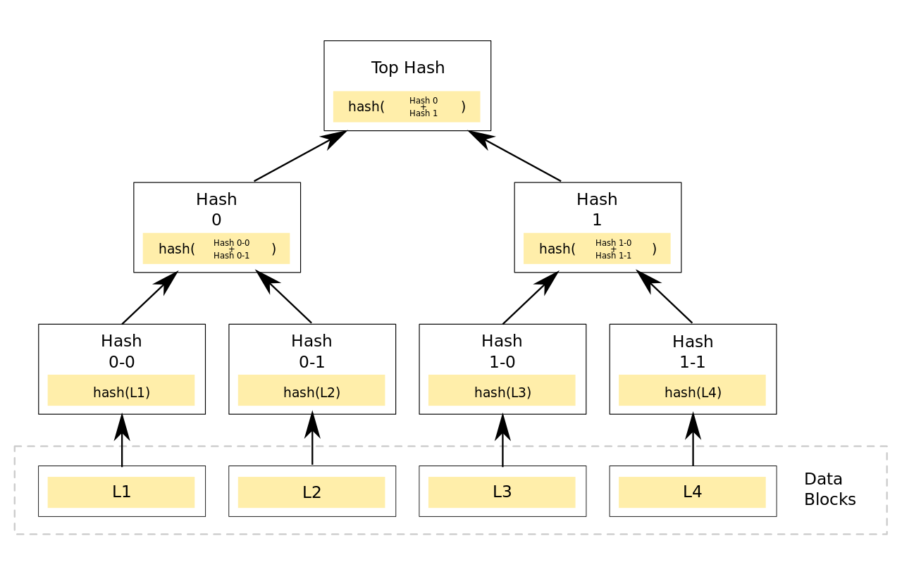
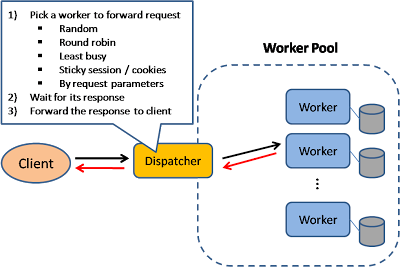
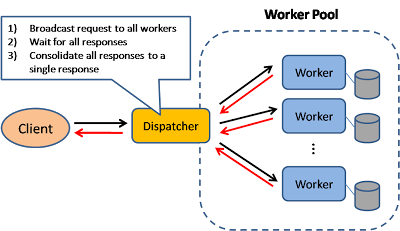
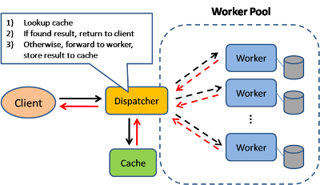
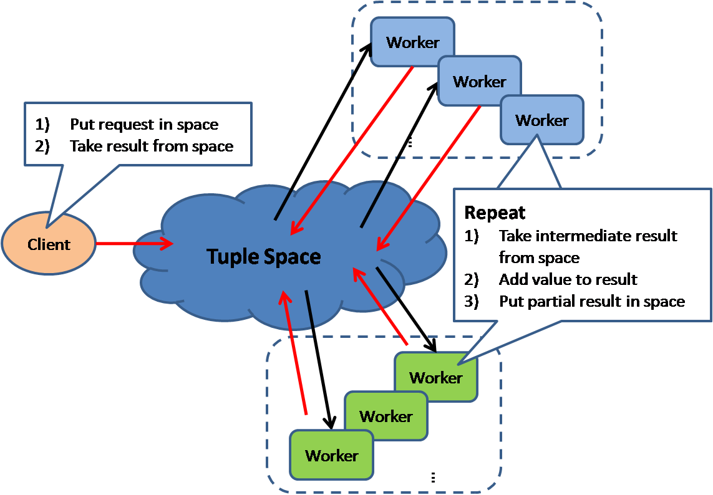
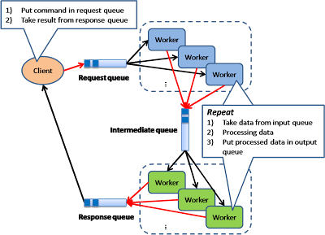
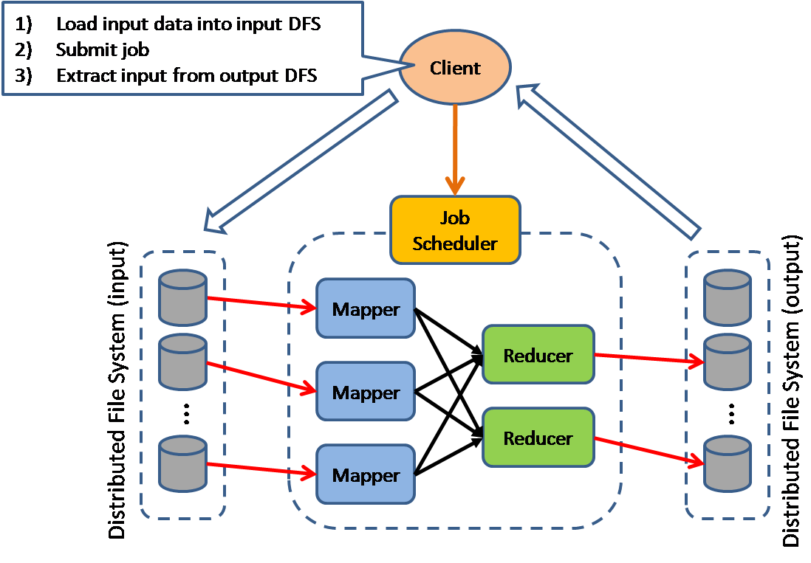
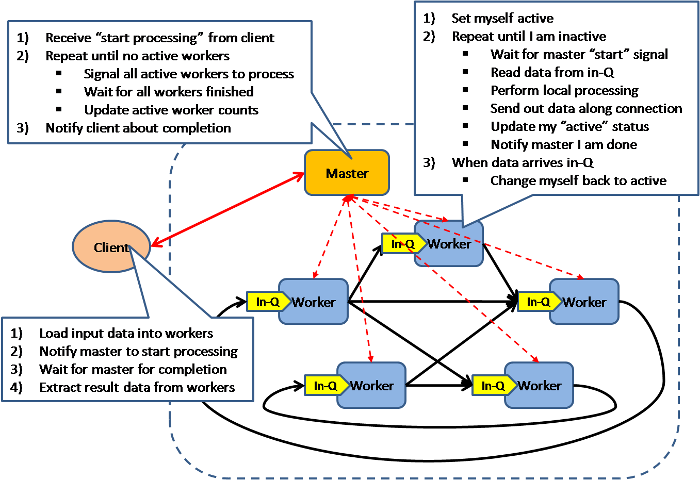
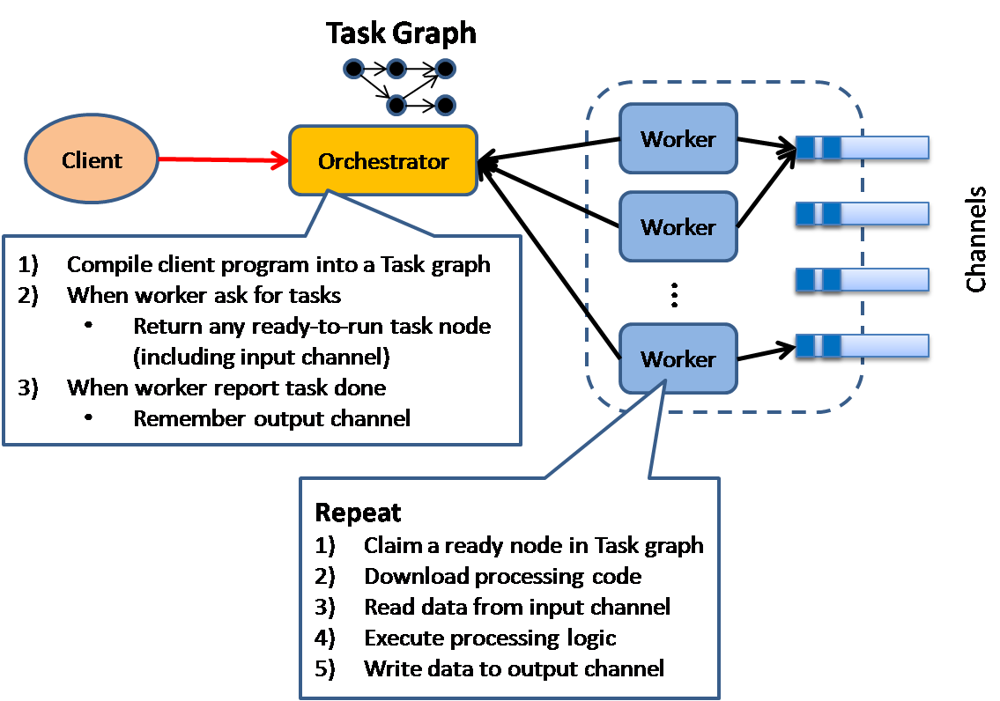

# System Architecture

* [Elements of Scale: Composing and Scaling Data Platforms](http://www.benstopford.com/2015/04/28/elements-of-scale-composing-and-scaling-data-platforms/)
* [Please stop calling databases CP or AP](http://martin.kleppmann.com/2015/05/11/please-stop-calling-databases-cp-or-ap.html)
* [What we talk about when we talk about distributed systems](http://videlalvaro.github.io/2015/12/learning-about-distributed-systems.html)
* [A Comprehensive Guide to Building a Scalable Web App on Amazon Web Services](https://www.airpair.com/aws/posts/building-a-scalable-web-app-on-amazon-web-services-p1)
* [Notes on Google's Site Reliability Engineering Book](http://danluu.com/google-sre-book/) or [the book itself](https://landing.google.com/sre/book.html)
* [Distributed Systems Reading List](https://dancres.github.io/Pages/)
* [Aws reinvent - scaling up to your 10M users](https://www.youtube.com/watch?v=vg5onp8TU6Q), [Slides](http://www.slideshare.net/AmazonWebServices/sov204-scaling-up-to-your-first-10-million-users-aws-reinvent-2014-41572495)
* [Grocking the system design interview](https://www.educative.io/collection/5668639101419520/)
* [Martin Fowler - NoSql Distilled](https://martinfowler.com/books/nosql.html)
* [Designing Data-Intensive Applications by Martin Kleppmann](http://dataintensive.net/)


## HDD

- Stores data on a series of constantly-spinning magnetic disks, called platters.
- Actuator arm with read/write heads positions the heads over the correct area of the drive to read/write (nanometers above platters).
- The drive may need to read from multiple locations in order to launch a program or load a file, which means it may have to wait for the platters to spin into the proper position multiple times before it can complete the command.
- If a drive is asleep or in a low-power state, it can take several seconds more for the disk to spin up to full power.
- Latency measured in milliseconds.
- SAS – Serial Attached SCSI – faster than HDD but still with a spinning platter.

## SSD

- Don't rely on moving parts or spinning disks.
- Data is saved to a pool of NAND flash.
- NAND itself is made up of what are called floating gate transistors. Unlike the transistor designs used in DRAM, which must be refreshed multiple times per second, NAND flash is designed to retain its charge state even when not powered up.
- NAND flash is organized in a grid. The entire grid layout is referred to as a *block*, while the individual rows that make up the grid are called a *page*.
- Common *page* sizes are 2K, 4K, 8K, or 16K, with 128 to 256 pages per block.
- *Block* size therefore typically varies between 256KB and 4MB.
- Data read/written at the *page* level (individual rows within the grid).
- Data erased at the *block* level (requires a high amount of voltage).
- Latency measured in microseconds.
- SSD controllers have caches and a DDR3 memory pool to help with managing the NAND.

## RAID

- [Redundant Array of Independent Disks](http://serverfault.com/questions/339128/what-are-the-different-widely-used-raid-levels-and-when-should-i-consider-them)
- *Performance* increase is a function of *striping*: data is spread across multiple disks to allow reads and writes to use all the disks' IO queues simultaneously.
- *Redundancy* is gained by creating special stripes that contain parity information, which can be used to recreate any lost data in the event of a hardware failure.
- Hardware RAID – a dedicated hardware controller with a processor dedicated to RAID calculations and processing.
- RAID 0 – *Stripping* – splits blocks of data into as many pieces as disks are in the array, and writes each piece to a separate disk.
    - Single disk failure means all data lost.
    - Increased in throughput: throughput of one disk * number of disks.
    - Total space is sum of all disks.
    - Requires min. 2 drives.
- RAID 1 – *Mirroring* – duplicates data identically on all disks.
    - Data preserved until loss of last drive.
    - Reads faster or the same, writes slower.
    - Total space = size of smallest disk.
    - Requires min. 2 drives.
- RAID 10 – combination of RAID 1 and 0 (in that order). Create arrays of RAID 1, and then apply RAID 0 on top of them. Requires min. 4 disks, additional ones need to be added in pairs. A single disk can be lost in each RAID 1 pair. Guaranteed high speed and availability. Total space = 50% of disk capacity.
- RAID 5 – uses a simple XOR operation to calculate parity. Upon single drive failure, the information can be reconstructed from the remaining drives using the XOR operation on the known data. Any single drive of the drives we have can fail (total number of drives >= 2). In case of drive failure the rebuilding process is IO intensive.
- RAID 6 – like RAID 5, but two disks can fail and no data loss.

## Latency, throughput
- Latency: propagation delay (msec)
- Throughput: data transfered per unit of time (bps). Example
- Bandwidth: maximum possible throughput
- Example:

| Type                    | Latency              | Throughput |
|-------------------------|----------------------|------------|
| shorter conveyor belt   | decrease             | no effect  |
| faster conveyor belt    | decrease             | increase   |
| fatter conveyor belt    | no effect            | increase   |
| compression             | no effect            | increase   |

- Little's law: occupancy = latency*troughput
- Bandwidth Delay Product
     - product of a data link's capacity (in bits per second) and its round-trip delay time
     - maximum amount of data on the network circuit at any given time
     - If the quantity of data sent is insufficient compared with the bandwidth-delay product, then the link is not being kept busy and the protocol is operating below peak efficiency

## CAP Theorem

- Shared-data systems can have at most two of the three following properties: Consistency, Availability, and tolerance to network Partitions.
- Consistency
    - There must exist a total order on all operations such that each operation looks as if it were completed at a single instant.
    - A system is consistent if an update is applied to all relevant nodes at the same logical time.
    - Standard database replication is not strongly consistent because special logic must be introduced to handle replication lag.
    - Consistency which is both instantaneous and global is impossible.
    - Mitigate by trying to push the time resolutions at which the consistency breaks down to a point where we no longer notice it.
    - inconsistency in large-scale reliable distributed systems has to be tolerated to support highly concurrent read/write and live nodes during network partitions
- Availability
    - Every request received by a *non-failing node* in the system must result in a response (that contains the results of the requested work).
    - Even when severe network failures occur, every request must terminate.
- Partition Tolerance
    - When a network is partitioned, all messages sent from nodes in one component of the partition to nodes in another component are lost.
    - Any distributed system can experience a network partition.
    - For a distributed system to *not* require partition-tolerance it would have to run on a network which is *guaranteed* to never drop messages (or even deliver them late) – **but such a network doesn't exist!**
- If one node is partitioned, then that node is *either* inconsistent or not available.
- If a system chooses to provide Consistency over Availability in the presence of partitions, it will preserve the guarantees of its atomic reads and writes by refusing to respond to some requests (like refuse writes on all nodes).
- If a system chooses to provide Availability over Consistency in the presence of partitions, it will respond to all requests, potentially returning stale reads and accepting conflicting writes (which can later be resolved with Vector Clocks, last-write wins, etc.).
- Most real-world systems require substantially less in the way of consistency guarantees than they do in the way of availability guarantees.
- Failures of consistency are usually tolerated or even expected, but just about every failure of availability means lost money.
- The choice of availability over consistency is a business choice, not a technical one.
- a write-always system needs merge operation for partition consolidation, example: Amazon shopping cart
- A(tomic)-C(onsistent)-I(solated)-D(urable) vs B(asically)-A(vailable)-S(oft state)-E(ventually consistent)

### Client side consistency

- strong consistency - clients are guaranteed to see the same order
- weak consistency - inconsistency window - clients are guaranteed to see the same order after writes are outside of consistency window
- eventual consistency - form of weak consistency, if no updates, guarantees inconsistencyWindow = f(communication delay, system load, #replicas)
    - improved models: "monotonic reads" and "read your writes" are desirable for programmers for easier reasoning
    - examples: DNS system, RDBMS asynchronous log shipping
- sticky session - tradeoff between load balancing and monotonic/read your writes consistency
### Server side consistency

- `N: #(replicas)`, `W: #(write target)`, `R: #(read source)`
- `(W+R > N)`: write set and read set overlap that guarantees strong consistency
- `(W+R <= N)`: weak consistency, R=1 mostly

| Example                                 |  Consistency |  N  |  W  |  R  |
|:---------------------------------------:|:------------:|:---:|:---:|:---:|
| synch RDBMS backup                      |    strong    |  2  |  2  |  1  |
| asynch RDBMS backup + slave read        |     weak     |  2  |  1  |  1  |
| fault tolerance                         |    strong    |  3  |  2  |  2  |
| high read load, epidemic updates        |     weak     | 100 |  1  |  1  |


## MapReduce

- Programming model and an associated implementation for processing and generating large data sets with a parallel, distributed algorithm on a cluster.
- Map procedure performs filtering and sorting.
- Reduce procedure performs a summary operation.
- Data transferred between map and reduce servers is compressed. Because servers aren't CPU bound it makes sense to spend on data compression and decompression in order to save on bandwidth and I/O.
- Advantages:
    - Nice way to partition tasks across lots of machines.
    - Handle machine failure.
    - Works across different application types. Almost every application has map reduce type operations. You can precompute useful data, find word counts, sort TBs of data, etc.
    - Computation can automatically move closer to the IO source.
    - Programs can be very small. As little as 20 to 50 lines of code.

For example, create search inverted index:

```java
// Mapper

/*
 * Processes a key/value pair to generate a set of intermediate key/value pairs
 *
 * @param key id of document
 * @param value text of page
 * @returns pair of word and document id
 */
public Tuple<String, String> map(String key, String value) {
  for (String word : tokenize(value))
    return new Tuple<>(word, key);
}
```

```java
// Reducer

/*
 * Merges all intermediate values associated with the same intermediate key
 *
 * @param key word
 * @param value list of document ids
 * @returns word to document ids pair
 */
public Tuple<String, List<String>> reduce(String key, List<String> value) {
  return new Tuple<>(key, value)
}
```

## Distributed Hash Table

- A decentralized distributed system that provides a lookup service similar to a hash table.
- Any participating node can efficiently retrieve the value associated with a given key.
- Responsibility for maintaining the mapping from keys to values is distributed among the nodes, in such a way that a change in the set of participants causes a minimal amount of disruption.
- Example implementations: Google's BigTable, Cassandra, Hazelcast, Aerospike, Riak.

### Data Partitioning (Sharding)
- http://itknowledgeexchange.techtarget.com/enterprise-IT-tech-trends/database-sharding-horizontal-partitioning-for-massive-scalability/
- Split data between multiple nodes.
- Data should be well distributed throughout the set of nodes.
- When a node is added or removed from set of nodes the expected fraction of objects that must be moved to a new node is the minimum needed to maintain a balanced load across the nodes.
- System should be aware which node is responsible for a particular data.
- Simple approach to partitioning of `hashCode(key) % n` breaks when we want to add/remove nodes.
- difficulties
    - joins are difficult across shards, denormalization is used which can lead to inconsistency problems
    - application level referential integrity is needed (SQL jobs clean up dangling references)
- strategies
    - horizontal (or key based)
        - split table horizontally
        - example: zip code range, might get unbalanced
    - vertical (row splitting): 
        - split data vertically
        - example: store profile data, photos, friends list separately
        - further partitioning might be needed
    - directory based partitioning, example:
        - lookup service knowing the current partitioning scheme
        - query1:  give me the db server for this record: `#recordId`
        - answer1: `#dbId`
        - pros: partitioning abstracted away from application
        - cons: 
            - performance overhead
            - mapping service can become SPOF 
    - composite paritioning: combination

### Consistent Hashing

- Special kind of hashing such that when a hash table is resized and consistent hashing is used, only `K/n` keys need to be remapped on average, where `K` is number of keys and `n` is number of buckets.
- In contrast, in most traditional hash tables, a change in the number of array slots causes nearly all keys to be remapped.
- Originated as a way of distributing requests among a changing population of Web servers.
- Consistent hashing maps objects to the same cache machine, as long as possible.
- When a cache machine is added, it takes its share of objects from all the other cache machines and when it is removed, its objects are shared between the remaining machines.
- Consistent hashing is based on mapping each object to a point on the edge of a circle (or equivalently, mapping each object to a real angle). The system maps each available machine (or other storage bucket) to many pseudo-randomly distributed points on the edge of the same circle.
- Apache Cassandra, for example, uses consistent hashing for data partitioning in the cluster.
- An alternative is *Rendezvous Hashing*.


([source](http://blog.imaginea.com/consistent-hashing-in-cassandra/))

## Replication strategies

### Synchronous vs asynchronous replication

### State transfer vs Operation transfer

- operation transfer
    - the master propagate a sequence of operations to the slave
    - less network load
    - needs reliabile messaging with delivery order guarantee

- state transfer
    - the master passes its latest state to the slave
    - robust against data loss
    - Merkle tree - mechanism to send only deltas

          

## Distributed System Consensus

- A fundamental problem in distributed computing is to achieve overall system reliability in the presence of a number of faulty processes.
- Often requires processes to agree on some data value that is needed during computation, e.g., whether to commit a transaction to a database, agreeing on the identity of a leader, state machine replication, and atomic broadcasts.
- Example of algorithms:
    - Paxos
    - [Raft](https://raft.github.io)

## [System design patterns](http://horicky.blogspot.ch/2010/10/scalable-system-design-patterns.html)
- Load Balancer

  

- Scatter Gather

  

- Result Cache

  

- Blackboard

  

- Pipe and Filter

  

- Map-reduce

  

- Bulk Synchronous Parallel

  

- Execution Orchestrator

  

## Resiliency Concepts (Advanced)

- Controlled Delay (CoDel, http://queue.acm.org/detail.cfm?id=2839461)
    - Active Queue Management (AQM) technique
    - Limit the size of a server's request queue without impacting reliability during normal operations.
    - Sets short timeouts, preventing long queues from building up.
    - If the queue has not been empty for the last `N` ms, then the amount of time spent in the queue is limited to `M` milliseconds. If the service has been able to empty the queue within the last `N` milliseconds, then the time spent in the queue is limited to `N` milliseconds.
    - Prevents a standing queue (because the `lastEmptyTime` will be in the distant past, causing an `M`-ms queuing timeout) while allowing short bursts of queuing for reliability purposes.
    - Values of `5ms` for `M` and `100ms` for `N` tend to work well across a wide set of use cases.
- Adaptive LIFO
    - During normal operating conditions, requests are processed in FIFO order, but when a queue is starting to form, the server switches to LIFO mode.
    - Places new requests at the front of the queue, maximizing the chance that they will meet the deadline set by Controlled Delay.
- Backup requests
    - Initiate a second ("backup") request to a different server `N` ms after the first request was made, if it still hasn't returned.
    - Dramatic improvement for high percentiles.
    - Example flow:
        1. Send request to first replica.
        2. Wait 2 ms, and send to second replica.
        3. Cancel request on other replica when starting to read second request's response.

## System Design Question Concepts

- Amount of data (disk)
- RAID configuration
- Amount of RAM – does everything need to be in RAM? (a lot of times – yes)
- Requests/sec
- Request time
- Data transfer rates
- Network requests in single data center
- Geographically separated locations
- Operations should never be more than `nlogn`, preferably `n`
- Sharding/Partitioning (by user/date/content-type/alphabetically) – how do we rebalance?
- Frontend/backend
- Backups? Backup a single user on how many servers?
- Many requests for the same data/lots of updates – all in cache
- Distribute so that the network is negligible
- Parallelizing network requests
- Fan-out (scatter and gather)
- Caching
- Load-balancing
- High availability
- MapReduce
- CDN
- Queues
- Timeouts
- Fail fast
- Circuit breakers
- Throttling
- Consistent hashing for sharding/partitioning
- Compression
- Possible to work harder on writes in order to make reads easier
- Hinted handoff
- Quorum
- Lamport, vector clocks

## System building patterns

## NOSQL patterns

## Platform Needs

- Monitoring (app, resp. time, throughput, OS level, errors)
- Alerting
- Metrics
- Distributed tracing + logging
- Datastores
- Caching
- Queues
- Service discovery
- Configuration
- Debugging, profiling
- ALM and deployment
- Auto scaling
- Load balancing, traffic splitting/control
- KPIs and actions based on them
- Deployment (blue-green), rollback, canary/testbed

# Membership Protocols (Advanced)

Summary mainly based on [this slide deck](https://speakerdeck.com/armon/swim-scalable-weakly-consistent-infection-style-process-group-membership-protocol) and the [SWIM paper](https://www.cs.cornell.edu/~asdas/research/dsn02-swim.pdf).

- Determining who are the live peers out of a dynamic group of members.
- Communicating over a network, assuming: packet loss, partitions.
- Useful for discovery in distributed systems.
- Protocols measured by:
    - Completeness (do all non-faulty members eventually detect a faulty node)
    - Speed of failure detection (time from failure until any node detects the failure)
    - Accuracy (rate of false positives)
    - Network load

## Heartbeating

- Every interval `T`, notify peers of liveness.
- If no update received from peer `P` after `T * limit`, mark as dead.
- Provides membership + failure detection.
- Broadcast a liveness message on every interval.
- Can be implemented with IP broadcast/multicast (generally disabled) or gossip.
- Network load is `O(n^2)` messages on each interval – becomes a bottleneck for large clusters.

## SWIM

- *S*calable *W*eakly-Consistent *I*nfection-Style Process Group *M*embership Protocol.
- Failure detection done by randomly pinging a single peer every interval and marking failed nodes.
- To improve accuracy, before marking a node as failed try indirect ping.
- Indirect ping is asking a set of `K` random peers to ping the failing candidate. This improves accuracy by attempting other network routes and reduce chance of packet loss.
- Network load is `O(n)`, making is feasible for large clusters.
- State updates on membership (joining/leaving the cluster) is achieved by piggybacking on the ping messages for gossip (infection/epidemic).
- Each ping/ack message sent between random nodes adds information about new and left/failed nodes.
- Because pings are sent randomly, nodes will learn about new/failing nodes at different times => eventually (weakly) consistent.
- Ping + piggybacking state updates = membership protocol.

# System architecture design canvas
- Step 1: Requirements clarifications: Always ask questions to find the exact scope of the problem you are solving.
- Step 2: System interface definition: Define what APIs are expected from the system. This will also ensure if you haven’t gotten any requirement wrong.
- Step 3: Back-of-the-envelope estimation: It’s always a good idea to estimate the scale of the system you are going to design.
- Step 4: Define data model: Although it is not required early on, this will clarify how data will flow among different components of the system and later will also guide you towards data partitioning.
- Step 5: High-level design: Draw a block diagram with 5-6 boxes representing core components of your system.
- Step 6: Detailed design: Dig deeper into 2-3 components; interviewers feedback should always guide you towards which parts of the system he wants you to explain further.
- Step 7: Bottlenecks: Try to discuss as many bottlenecks (and different approaches to mitigate them) as possible.
